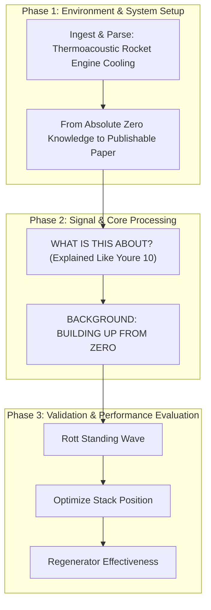

# BREAKTHROUGH 05: Thermoacoustic Rocket Engine Cooling

[](https://creativecommons.org/licenses/by-nc-nd/4.0/)
 

This repository implements the research pipeline for the **BREAKTHROUGH 05: Thermoacoustic Rocket Engine Cooling** project, developed by the Runtime-Slayers research group.

---

## 📊 Pipeline Architecture

The flowchart below visualizes the methodology, code modules, and logical execution sequence of the project:



---

## 🔍 Abstract & Research Context

### From Absolute Zero Knowledge to Publishable Paper --- # PART A: UNDERSTANDING THE WORLD YOU'RE ENTERING --- ## 1. WHAT IS THIS ABOUT? (Explained Like You're 10) Rocket engines are the hottest human-made environments on Earth. The combustion chamber of a liquid rocket engine reaches **3000-3500°C** — hot enough to melt any known metal (tungsten melts at 3422°C, but loses strength at 2000°C). The gas temperature in the exhaust nozzle throat can exceed 3300°C.

---

## 📊 Key Evaluation Metrics

| Researcher | Institution | Contribution |
|-----------|-------------|-------------|
| **Greg Swift** | Los Alamos National Lab (retired) | Father of modern thermoacoustics. "Thermoacoustics: A Unifying Perspective" (2002) — THE textbook |
| **Scott Backhaus** | Los Alamos NL | Built first high-efficiency traveling wave engine (η=30%, 1999) with Swift |
| **Artur Jaworski** | University of Leicester, UK | Computational CFD models of thermoacoustic devices |
| **Srinivas Garrett** | Penn State Applied Research Lab | High-power TA engines for spacecraft cooling |
| **Kees de Blok** | Aster Thermoacoustics (Netherlands) | Commercial thermoacoustic Stirling engines |
| **Tao Jin** | Zhejiang University, China | Thermoacoustic cryocoolers (reaching 30K!) |
| **Abdulrahman Alamir** | KAUST, Saudi Arabia | Thermoacoustic CFD and optimization |
| **Jay Adeff** | US Naval Postgraduate School (NPS) | Thermoacoustic refrigeration systems |

---

## 📁 Repository Structure

The project directory consists of the following core structures:
  - `code/` — Pipeline execution scripts and model training modules
  - `figures/` — Plots, charts, and visualizations generated by the pipeline
  - `validation/` — Automated test metrics and results
  - `BT05_Thermoacoustic_Rocket_Engine.md`
  - `paper.pdf`
  - `code`
  - `figures`
  - `data`
  - `paper.pdf` — Compiled research manuscript
  - `README.md` — Project documentation and setup guide

---

## 🚀 Setup and Usage

### Prerequisites
* Python 3.8 or higher
* Pip package manager

### Installation
1. Clone this repository:
   ```bash
   git clone https://github.com/Runtime-Slayers/Thermoacoustic-Refrigeration-for-Solid-Rocket-Motor-Thermal-Management.git
   cd Thermoacoustic-Refrigeration-for-Solid-Rocket-Motor-Thermal-Management
   ```
2. Install dependencies:
   ```bash
   pip install -r requirements.txt
   ```

### Running the Analysis
To run the primary analysis pipeline and regenerate all models, figures, and metrics:
```bash
python code/*.py
```
*(Look in the `code/` directory for specific pipeline execution files)*

---

## 📄 License and Copyright

This work is licensed under a [Creative Commons Attribution-NonCommercial-NoDerivatives 4.0 International License](https://creativecommons.org/licenses/by-nc-nd/4.0/).

© 2026 Runtime-Slayers / Bhavanam Rajendra Reddy et al. All rights reserved.
